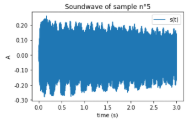

# Visualization and Listening

### Audio Generated

## Student Generator without feature Distillation 

## Student Generator with feature Distillation 

## Student Generator with feature Distillation and Classifier

## Student Generator with feature Distillation, Classifier and Limiter number of Data in the training 

<audio controls>
  <source src="samples/sample_source_5.mp3" type="audio/mp3">
Your browser does not support the audio element.
</audio>

### Soundwave and Spectrogramme of sample n°5

