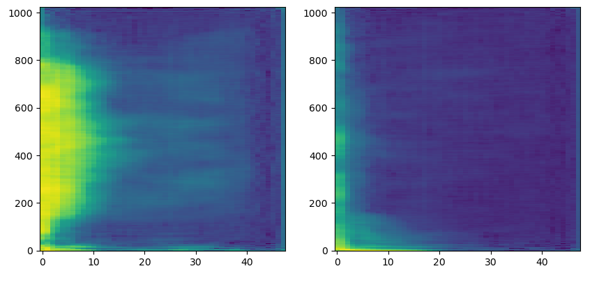

# Compressing Neural Networks Project

The complete research thesis can be read here             
 

## Visualization and Listening
## To generate samples, we take a latent vector of size 131 and pass it to the teacher and the student. For each model, we take 2 same latent spaces and obtain 2 generations. The student generation should sound like his corresponding teacher generation, as it is the same latent vector used. 

## Model 1 : Only MSE Generation teacher, Generation student 

### Teacher
<audio controls>
  <source src="no_features/teacher0.mp3" type="audio/mp3">
Your browser does not support the audio element.
</audio>

<audio controls>
  <source src="no_features/teacher1.mp3" type="audio/mp3">
Your browser does not support the audio element.
</audio>

### Student reconstruction 
<audio controls>
  <source src="no_features/to_rgb_nofeatures_0.mp3" type="audio/mp3">
Your browser does not support the audio element.
</audio>

<audio controls>
  <source src="no_features/to_rgb_nofeatures_1.mp3" type="audio/mp3">
Your browser does not support the audio element.
</audio>

## Model 2 : Add feature loss

### Teacher
<audio controls>
  <source src="features/gen0_teacher.mp3" type="audio/mp3">
Your browser does not support the audio element.
</audio>

<audio controls>
  <source src="features/gen1_teacher.mp3" type="audio/mp3">
Your browser does not support the audio element.
</audio>

### Student reconstruction
<audio controls>
  <source src="features/gen0.mp3" type="audio/mp3">
Your browser does not support the audio element.
</audio>

<audio controls>
  <source src="features/gen1.mp3" type="audio/mp3">
Your browser does not support the audio element.
</audio>

## Model 3: Feature Loss + Classif Loss

### A. Feature Loss + Classif Loss with Fake Data

#### Teacher
<audio controls>
  <source src="features_classif/teacher2.mp3" type="audio/mp3">
Your browser does not support the audio element.
</audio>

<audio controls>
  <source src="features_classif/teacher3.mp3" type="audio/mp3">
Your browser does not support the audio element.
</audio>

#### Student reconstruction
<audio controls>
  <source src="features_classif/gen2.mp3" type="audio/mp3">
Your browser does not support the audio element.
</audio>

<audio controls>
  <source src="features_classif/gen3.mp3" type="audio/mp3">
Your browser does not support the audio element.
</audio>

### B. Feature Loss + Classif Loss with  Real Data

#### Teacher
<audio controls>
  <source src="features_classif_real_data/audio2_teacher.mp3" type="audio/mp3">
Your browser does not support the audio element.
</audio>

<audio controls>
  <source src="features_classif_real_data/audio3_teacher.mp3" type="audio/mp3">
Your browser does not support the audio element.
</audio>

#### Student reconstruction
<audio controls>
  <source src="features_classif_real_data/audio2.mp3" type="audio/mp3">
Your browser does not support the audio element.
</audio>

<audio controls>
  <source src="features_classif_real_data/audio3.mp3" type="audio/mp3">
Your browser does not support the audio element.
</audio>

## Model 4: Feature Loss + Classif Loss + change in Leaky Relu Last layer 

### Teacher
<audio controls>
  <source src="features_classif_real_leaky_realu/teacher0.mp3" type="audio/mp3">
Your browser does not support the audio element.
</audio>

<audio controls>
  <source src="features_classif_real_leaky_realu/teacher1.mp3" type="audio/mp3">
Your browser does not support the audio element.
</audio>

### Student reconstruction
<audio controls>
  <source src="features_classif_real_leaky_realu/student0.mp3" type="audio/mp3">
Your browser does not support the audio element.
</audio>

<audio controls>
  <source src="features_classif_real_leaky_realu/student1.mp3" type="audio/mp3">
Your browser does not support the audio element.
</audio>

